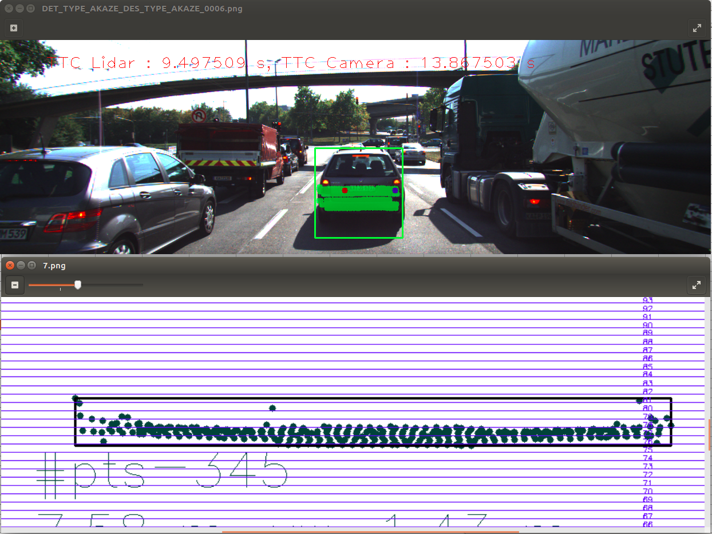
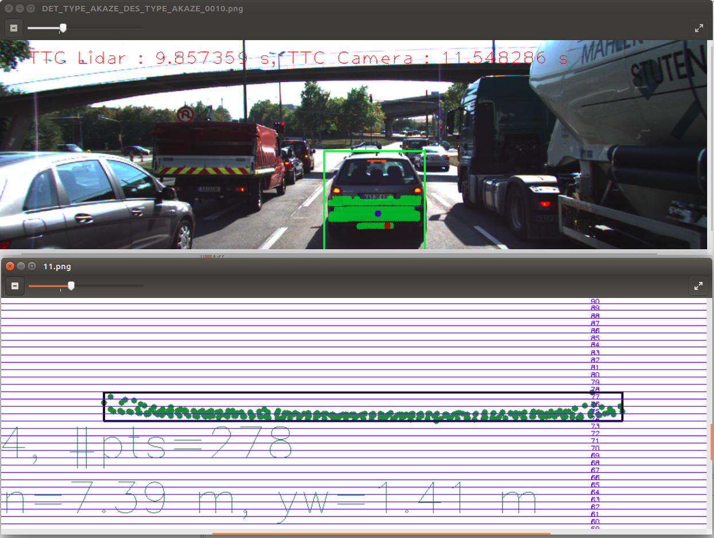
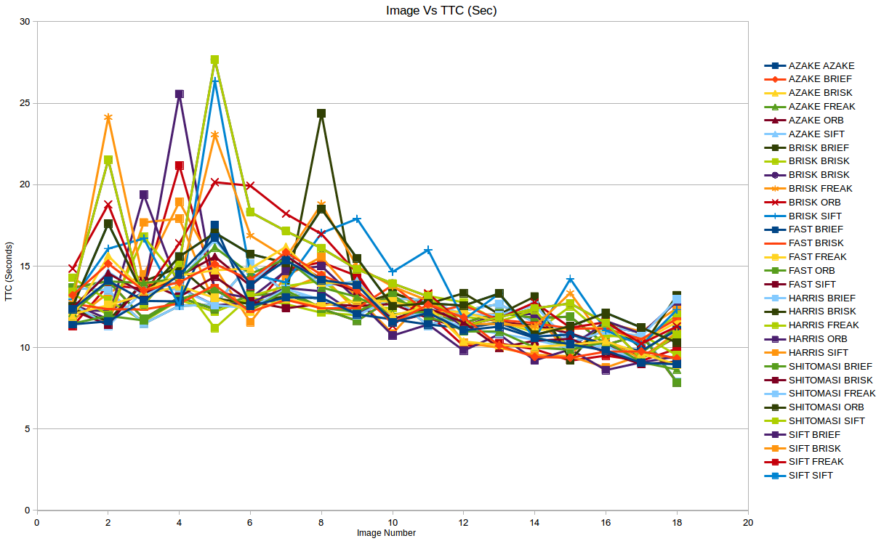
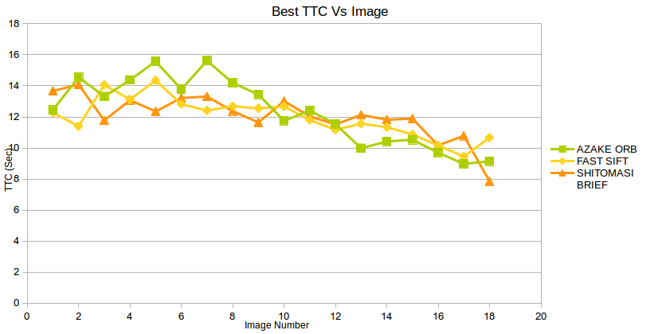
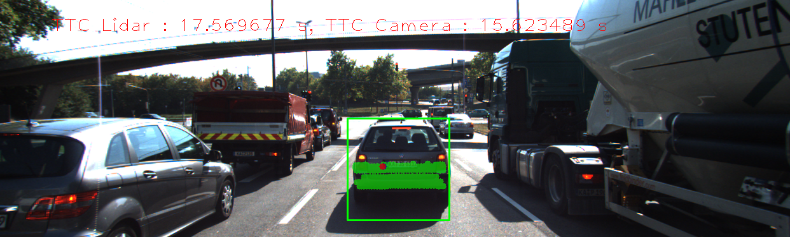
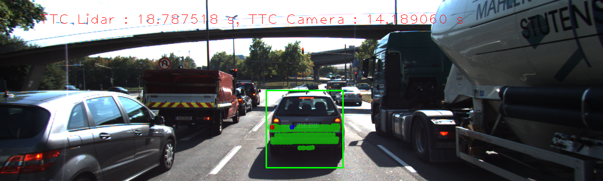
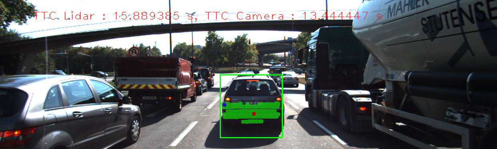
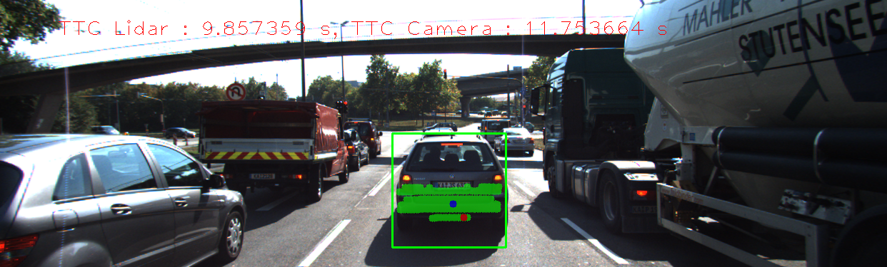
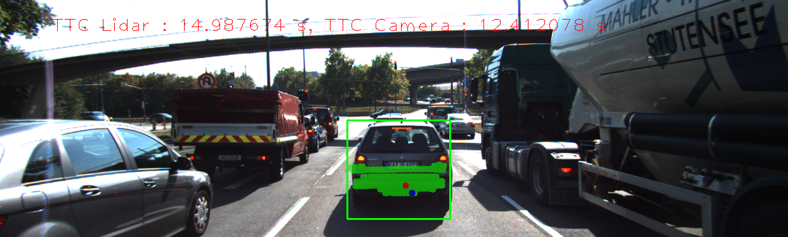

# SFND 3D Object Tracking
As part of this project following schematic is implemented. At the end TTC (Time to collision) based on LIDAR and CAMERA measurements are calculated.

In this project, you the missing parts in the schematic will be implemented. To do this, you will complete four major tasks: 
1. Match 3D objects over time by using keypoint correspondences. 
2. Compute the TTC based on Lidar measurements. 
3. Compute the TTC based on Camera, to achieve this first keypoint matches were associated with regions of interest and then TTC was computed based on those matches. 
4. Conducted various tests with the framework. Goal is to identify the most suitable detector/descriptor combination for TTC estimation and also to search for problems that can lead to faulty measurements by the camera or Lidar sensor. 

Following paragraphs detail more about how each of the above steps was realized. 

## Match 3D Objects
Function 'matchBoundingBoxes' in camFusion_Student.cpp implements a mechanism to identify unique box matches b/w previous and current frame using matched keypoints. This is achieved by following the below steps.
 - Loop through each of the matched keypoints, search in prev and curr frame for the boxes that contain these match points
 - For each matched keypoint, box ids are stored if only one box in prev and one box in curr frame was identified else the point is discarded
 - No of occurrences of unique prev box id , curr box id pairs is counted.
 - For a give prev box id select the pair(prev , curr box id) with maximum occurrence.

## Compute TTC LIDAR
Function 'computeTTCLidar' in camFusion_Student.cpp computes the TTC based on the LIDAR Data points. Following steps were implemented for calculating TTC
 - Sort previous and current lidar points in ascending order based on x coordinates.
 - Loop through each of the sorted prev lidar points from beginning, find the point with smallest x that has atleast
   neigh_thold (100) points within 0.1 meters. Stop searching once such a point is found.
 - Loop through each of the sorted current lidar points from beginning, find the point with smallest x that has atleast
   neigh_thold (100) points within 0.1 meters. Stop searching once such a point is found.
 - Use the points identified in above two steps to calculate TTC.

## Compute TTC CAMERA 
As mentioned in the introduction CAMERA TTC calculation involves 2 steps. Following are the details 

### Cluster Keypoint Matches With ROI
Function 'clusterKptMatchesWithROI' in camFusion_Student.cpp associates a given bounding box with the keypoints it contains. Following steps were followed to realize this.
- From kptMatches buffer , identify all the points that fall in the given box. Store such points in 'bBkptMatches'
- Calculate the mean and std of distance of the points in 'bBkptMatches' buffer.
- Add all the points in bBkptMatches that are with in +/- 2* std of mean to boundingBox.kptMatches. This removes outliers around 95% of the points would be left after this steps.

### Comput TTC CAMERA
Function 'computeTTCCamera' in camFusion_Student.cpp implements TTC calculation for camera. To calculate TTC distance of each of the matchpoints with other points is calculated and ratio of distance between prev, current frames are calculated and stored in a buffer. Median point of this buffer is used for calculating the TTC. 

## Analysis

### LIDAR TTC Performance Analysis:
To analyze the LIDAR TTC performance , TTC calculated manually was compared with the TTC calculated by the program. Following steps were followed
 #### Manual Calculation
 - 2D top view of the LIDAR points was drawn using show3DObjects function.Measurement lines were drawn across the top view image every 0.1 meters. 
 - Run the code for each image store the 2D top view LIDAR plot for futher analysis. 
 - Calculate the distance of the vehicle manually by counting how many lines are there between LIDAR Points and image base.
 - Calculate the TTC using the formula discussed in the course.

 #### TTC LIDAR Logging
 - Modify code to store the calculated TTC into a file for each image. 

 #### Results 
 |Image Number	|	Manual Distance Measured (mts) |	TTC Manual (sec) |	TTC Calculated (sec) |	Diff (Manual vs Calc) |
 |-------------|--------------------------------|------------------|----------------------|-----------------------|
 |1	|7.95|  |  |			|
 |2	|7.9	|15.8	|12.9722	| 2.8278 |
 |3	|7.85|	15.7|	12.264|	3.436|
 |4	|7.8|	15.6|	13.9161	|1.6839|
 |5	|7.75|	15.5|	14.8865|	0.6135|
 |6	|7.65|	7.65|	12.1873|	-4.5373|
 |7	|7.6|	15.2|	9.49751|	5.70249|
 |8	|7.55|	15.1|	17.5697|	-2.4697|
 |9	|7.5|	15|	18.7875|	-3.7875|
 |10	|7.45|	14.9|	15.8894|	-0.9894|
 |11	|7.4|	14.8|	9.85736|	4.94264|
 |12	|7.34|	12.2333333333|	14.9877|	-2.7543666667|
 |13	|7.28|	12.1333333333|	10.1|	2.0333333333|
 |14	|7.2|	9|	9.22307|	-0.22307|
 |15	|7.12|	8.9|	10.9678|	-2.0678|
 |16	|7.03|	7.8111111111|	8.09422|	-0.2831088889|
 |17	|6.95|	8.6875|	8.81392|	-0.12642|
 |18	|6.87|	8.5875|	10.2926|	-1.7051|
 |19	|6.79|	8.4875|	8.30978|	0.17772|

 #### Analysis 
 In the above table there are serveral images where there is a huge difference between manual and automated calculated values. I took 2 images with maximum differences. showLidarImgOverlay function was modified to highlight curr (red) and prev (blue) LIDAR points that were used for TTC calculation and save the resultant image. I have compared the 2D plots and augmented camera images for the images with maximum difference following are the images.

 

 

 As per my observation following might be the cause for the discrepancy
 - Selection of points is not accurate everytime. Instead of selecting the closest point sometimes i am choosing slightly farther point. This might be happening because of the logic used for outliers 
 - In TTC calculation LIDAR's inherent inaccuracies were considered.

### CAMERA TTC Performance Analysis:
To compare the TTC calculation performance of different detector & descriptors i have analyzed the variation in the slope. Following are more details. 
- Modify code to store the TTC calculated by CAMERA in a file. Name the file based on selected image number , detector type and descriptor type.
- Load the values for all the combinations into an excel. The same can be found in the path '/output/CAMERA_TTC_Performance_Analaysis.xlsx'.
- Calculate the slope of TTC between two consecutive images
- Calculate mean and stddev of the slope.
- Repeat this for all the detector , descriptor combinations. 
- Identify the top 3 detector , descriptor combination with minimal slope stddev.

#### Analysis

Following picture show plots of TTC for different images calculated using different detector , descriptor combinations. This picture does not include TTC values of ORB Detector for all the descriptors as there were cases where output was NAN. 

 

I choose this approach as manual TTC calculated using LIDAR 2D plots cannot be used and it was not insisted.

Following are top 3 detector , descriptors based on above method. 
 - AZAKE, ORB 
 - FAST , SIFT 
 - SHITOMASI , BRIEF
 
Following picture shows the TTC performance of these three top performing methods.
 
 
 Excel document 'output/CAMERA_TTC_Performance_Analaysis.xlsx' has all the calculations. 
 
 #### Fault Measurement Analysis
 - In images 7 to 11 most of the detector , descriptor combinations produce erroneous results. This might be because of the way bounding box is fitted , in all these images right tail light is partially outside the bounding box. So even if there were keypoints from the the tail light they are getting removed. This might be causing wrong TTC calculations. Please see the below images. 
  
  
  
  
  
 
 - ORB produces NAN for many images with BRIEF , FREAK , SIFT descriptors. This might be because of the combination but i am not certain. 
 

## Dependencies for Running Locally
* cmake >= 2.8
  * All OSes: [click here for installation instructions](https://cmake.org/install/)
* make >= 4.1 (Linux, Mac), 3.81 (Windows)
  * Linux: make is installed by default on most Linux distros
  * Mac: [install Xcode command line tools to get make](https://developer.apple.com/xcode/features/)
  * Windows: [Click here for installation instructions](http://gnuwin32.sourceforge.net/packages/make.htm)
* Git LFS
  * Weight files are handled using [LFS](https://git-lfs.github.com/)
* OpenCV >= 4.1
  * This must be compiled from source using the `-D OPENCV_ENABLE_NONFREE=ON` cmake flag for testing the SIFT and SURF detectors.
  * The OpenCV 4.1.0 source code can be found [here](https://github.com/opencv/opencv/tree/4.1.0)
* gcc/g++ >= 5.4
  * Linux: gcc / g++ is installed by default on most Linux distros
  * Mac: same deal as make - [install Xcode command line tools](https://developer.apple.com/xcode/features/)
  * Windows: recommend using [MinGW](http://www.mingw.org/)

## Basic Build Instructions

1. Clone this repo.
2. Make a build directory in the top level project directory: `mkdir build && cd build`
3. Compile: `cmake .. && make`
4. Run it: `./3D_object_tracking`.
